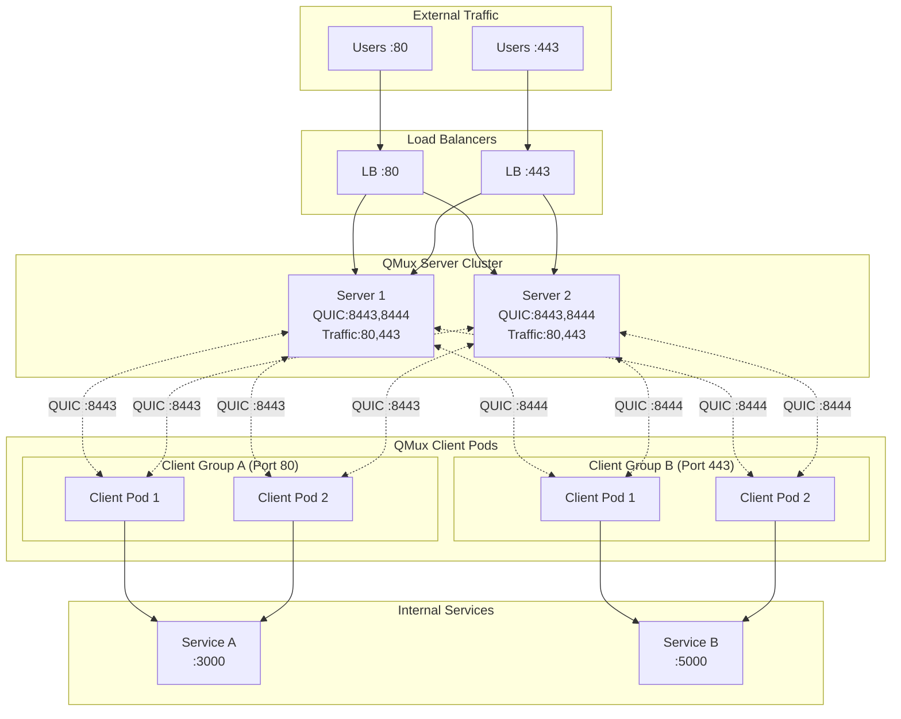
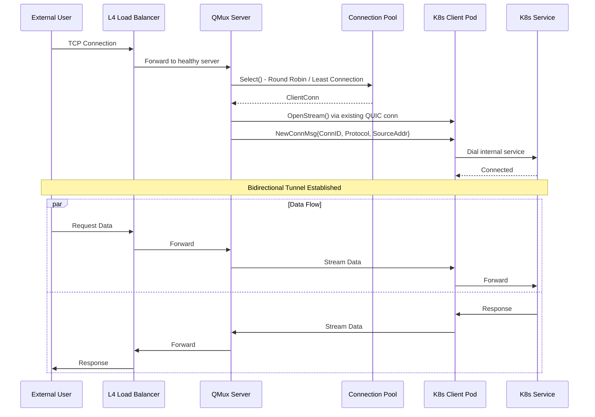

# QMux

[](https://github.com/Mmx233/QMux/blob/main/LICENSE)
[](https://github.com/Mmx233/QMux/releases)
[](https://goreportcard.com/report/github.com/Mmx233/QMux)
[](https://hub.docker.com/repository/docker/mmx233/qmux)

A high-availability L4 (transport layer) NAT traversal tool built on the QUIC protocol.

QMux operates at Layer 4 of the OSI model, enabling secure TCP/UDP tunneling through NAT/firewalls by establishing QUIC connections between clients and servers. It works at the transport layer, forwarding raw TCP streams without inspecting application-layer protocols. It supports multi-server configurations with automatic load balancing, mTLS authentication, and 0-RTT session resumption for fast reconnections.

# Performance

## Test Environment

| Component | Specification        |
|-----------|----------------------|
| CPU       | Apple M4             |
| Cores     | 10                   |
| Memory    | 16 GB                |
| OS        | macOS (darwin/arm64) |
| Go        | 1.25.5               |

## Benchmark Results

### Discard Test

| Test | Raw (Baseline) | QMux        | Efficiency |
|------|----------------|-------------|------------|
| TCP  | 126,410 Mbps   | 2,710 Mbps  | 2.1%       |
| UDP  | 6,081 Mbps     | 3,430 Mbps  | 56.4%      |

### iperf3 Comprehensive Benchmark

#### TCP

| Test                  | Throughput (recv) | Avg CPU (%) | Max CPU (%) | Avg/Max Mem (MB) |
|-----------------------|-------------------|-------------|-------------|------------------|
| TCP Baseline 1-thread | 129,551 Mbps      | 7.8         | 8.0         | 1.1 / 1.1        |
| TCP Baseline 2-thread | 151,449 Mbps      | 7.8         | 8.0         | 1.2 / 1.2        |
| TCP Baseline 4-thread | 114,702 Mbps      | 7.8         | 8.0         | 1.3 / 1.3        |
| TCP QMux 1-thread     | 2,773 Mbps        | 42.0        | 42.1        | 7.4 / 9.3        |
| TCP QMux 2-thread     | 2,574 Mbps        | 51.1        | 51.1        | 10.6 / 15.0      |
| TCP QMux 4-thread     | 2,304 Mbps        | 66.1        | 66.1        | 16.2 / 21.1      |

#### UDP

| Test                  | Throughput (recv) | Avg CPU (%) | Max CPU (%) | Avg/Max Mem (MB) |
|-----------------------|-------------------|-------------|-------------|------------------|
| UDP Baseline 1-thread | 25,309 Mbps       | 16.9        | 17.1        | 14.8 / 14.8      |
| UDP Baseline 2-thread | 45,435 Mbps       | 16.9        | 17.1        | 14.8 / 14.8      |
| UDP QMux 1-thread     | 1,343 Mbps        | 50.3        | 50.5        | 5.1 / 6.2        |
| UDP QMux 2-thread     | 1,122 Mbps        | 56.6        | 56.8        | 5.2 / 6.6        |


Notes:

- Raw baseline represents direct loopback performance without any tunneling
- QMux adds QUIC encryption, multiplexing, and protocol overhead
- All tests use only 1 QUIC connection
- Resource metrics are measured at the Go runtime level and include the entire test process (test framework, QMux server, QMux client, and other goroutines); values are approximate and provided for reference

Run benchmarks yourself:

```bash
# Quick speed report
go test -v -run TestSpeedReport ./cmd/run/...

# Comprehensive iperf3 benchmark
# Require iperf3 installed
go test -v -run TestIperf3 ./cmd/run/...
```

# High Available Architecture

## System Overview



## Data Tunnel Flow


