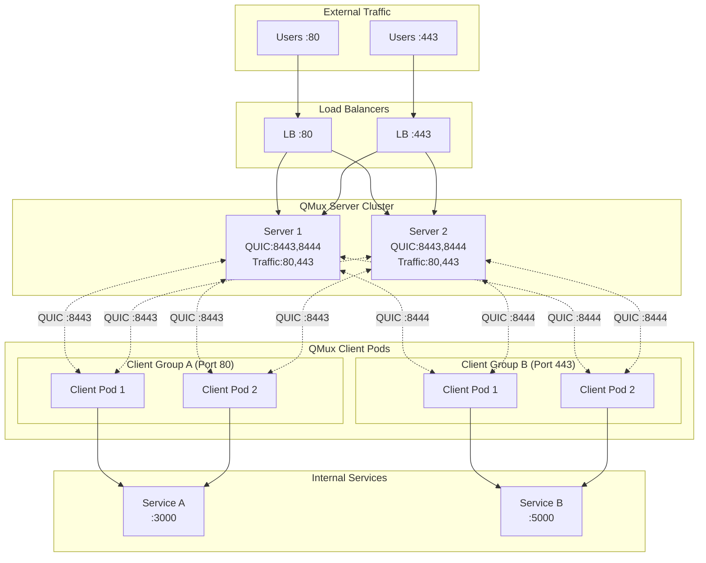
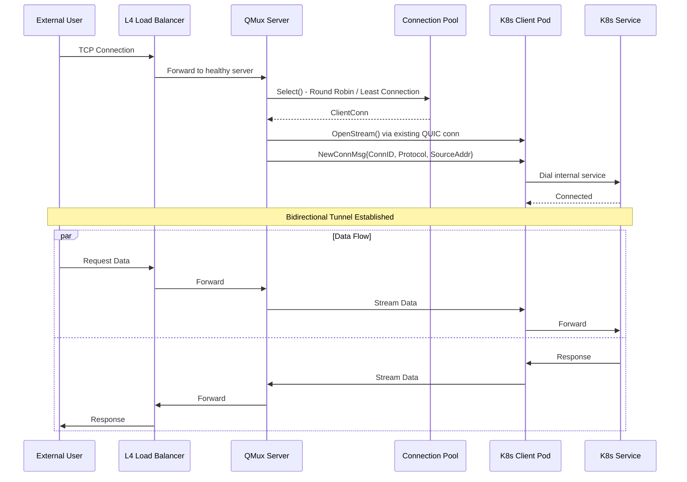

# QMux

[](https://github.com/Mmx233/QMux/blob/main/LICENSE)
[](https://github.com/Mmx233/QMux/releases)
[](https://goreportcard.com/report/github.com/Mmx233/QMux)
[](https://hub.docker.com/repository/docker/mmx233/qmux)

A high-availability L4 (transport layer) NAT traversal tool built on the QUIC protocol.

QMux operates at Layer 4 of the OSI model, enabling secure TCP/UDP tunneling through NAT/firewalls by establishing QUIC connections between clients and servers. It works at the transport layer, forwarding raw TCP streams without inspecting application-layer protocols. It supports multi-server configurations with automatic load balancing, mTLS authentication, and 0-RTT session resumption for fast reconnections.

# Get Started

## Installation

### From Binary

Download the latest release from [GitHub Releases](https://github.com/Mmx233/QMux/releases).

### From Source

```bash
go install github.com/Mmx233/QMux@latest
```

### Docker

```bash
docker pull mmx233/qmux
```

## Quick Start

### 1. Generate Certificates

QMux uses mTLS for authentication by default. Generate the required certificates for testing:

```bash
qmux generate certs -s your-server-domain.com
```

The `-s` flag specifies the server DNS name for the certificate (required). You can specify multiple names:

```bash
qmux generate certs -s example.com -s qmux.example.com
```

Certificates are valid for 10 years by default. Use `-y` to customize:

```bash
qmux generate certs -s example.com -y 5  # 5 years validity
```

This creates in pwd:
- `certs/ca.crt` - CA certificate
- `certs/server.crt` / `certs/server.key` - Server certificate
- `certs/client.crt` / `certs/client.key` - Client certificate

### 2. Generate Configuration Files

```bash
# Generate server config
qmux generate config server -o server.yaml

# Generate client config
qmux generate config client -o client.yaml
```

### 3. Configure Example Server

Edit `server.yaml`:

```yaml
listeners:
  - quic_addr: "0.0.0.0:8443"    # QUIC control port
    traffic_addr: "0.0.0.0:8080" # Traffic forwarding port
    protocol: "both"              # tcp, udp, or both

auth:
  method: "mtls"
  ca_cert_file: "./certs/ca.crt"

tls:
  server_cert_file: "./certs/server.crt"
  server_key_file: "./certs/server.key"
```

### 4. Configure Example Client

Edit `client.yaml`:

```yaml
server:
  servers:
    - address: "your-server-ip:8443"
      server_name: "qmux-server"

local:
  host: "127.0.0.1"
  port: 3000  # Your local service port

tls:
  ca_cert_file: "./certs/ca.crt"
  client_cert_file: "./certs/client.crt"
  client_key_file: "./certs/client.key"
```

### 5. Run

```bash
# Start server (on public server)
qmux run server -c server.yaml

# Start client (on machine behind NAT)
qmux run client -c client.yaml
```

Now external traffic to `your-server-ip:8080` will be forwarded to your local service on port 3000.

# Performance

## Test Environment

| Component | Specification        |
|-----------|----------------------|
| CPU       | Apple M4             |
| Cores     | 10                   |
| Memory    | 16 GB                |
| OS        | macOS (darwin/arm64) |
| Go        | 1.25.5               |

## Benchmark Results

### Discard Test

| Test | Raw (Baseline) | QMux        | Efficiency |
|------|----------------|-------------|------------|
| TCP  | 126,410 Mbps   | 2,710 Mbps  | 2.1%       |
| UDP  | 6,081 Mbps     | 3,430 Mbps  | 56.4%      |

### iperf3 Comprehensive Benchmark

#### TCP

| Test                  | Throughput (recv) | Avg CPU (%) | Max CPU (%) | Avg/Max Mem (MB) |
|-----------------------|-------------------|-------------|-------------|------------------|
| TCP Baseline 1-thread | 129,551 Mbps      | 7.8         | 8.0         | 1.1 / 1.1        |
| TCP Baseline 2-thread | 151,449 Mbps      | 7.8         | 8.0         | 1.2 / 1.2        |
| TCP Baseline 4-thread | 114,702 Mbps      | 7.8         | 8.0         | 1.3 / 1.3        |
| TCP QMux 1-thread     | 2,773 Mbps        | 42.0        | 42.1        | 7.4 / 9.3        |
| TCP QMux 2-thread     | 2,574 Mbps        | 51.1        | 51.1        | 10.6 / 15.0      |
| TCP QMux 4-thread     | 2,304 Mbps        | 66.1        | 66.1        | 16.2 / 21.1      |

#### UDP

| Test                  | Throughput (recv) | Avg CPU (%) | Max CPU (%) | Avg/Max Mem (MB) |
|-----------------------|-------------------|-------------|-------------|------------------|
| UDP Baseline 1-thread | 25,309 Mbps       | 16.9        | 17.1        | 14.8 / 14.8      |
| UDP Baseline 2-thread | 45,435 Mbps       | 16.9        | 17.1        | 14.8 / 14.8      |
| UDP QMux 1-thread     | 1,343 Mbps        | 50.3        | 50.5        | 5.1 / 6.2        |
| UDP QMux 2-thread     | 1,122 Mbps        | 56.6        | 56.8        | 5.2 / 6.6        |


Notes:

- Raw baseline represents direct loopback performance without any tunneling
- QMux adds QUIC encryption, multiplexing, and protocol overhead
- All tests use only 1 QUIC connection
- Resource metrics are measured at the Go runtime level and include the entire test process (test framework, QMux server, QMux client, and other goroutines); values are approximate and provided for reference

Run benchmarks yourself:

```bash
# Quick speed report
go test -v -run TestSpeedReport ./cmd/run/...

# Comprehensive iperf3 benchmark
# Require iperf3 installed
go test -v -run TestIperf3 ./cmd/run/...
```

# High Available Architecture

## System Overview



## Data Tunnel Flow


