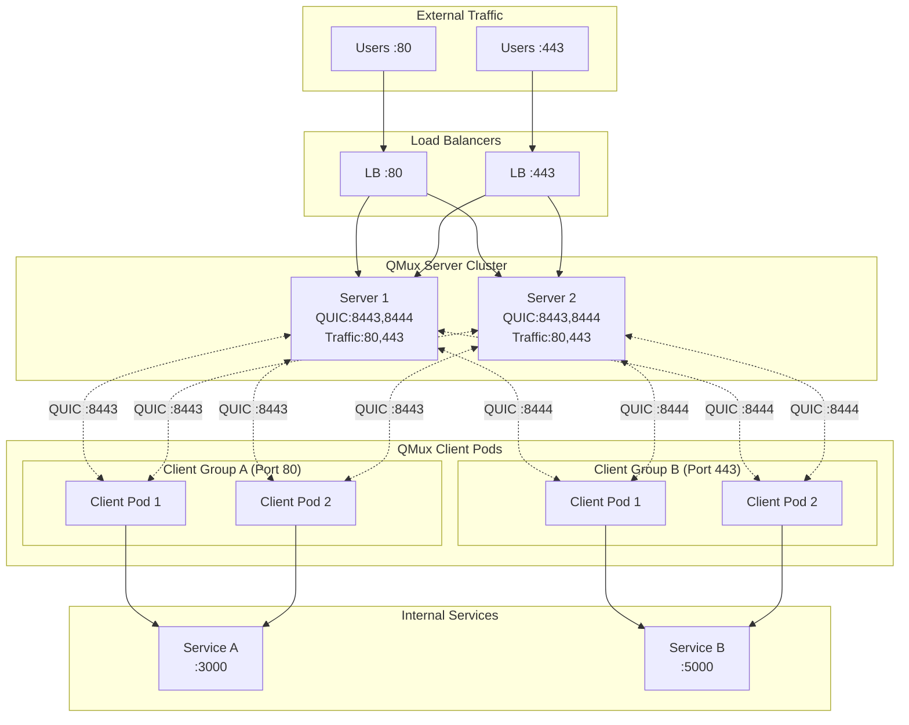
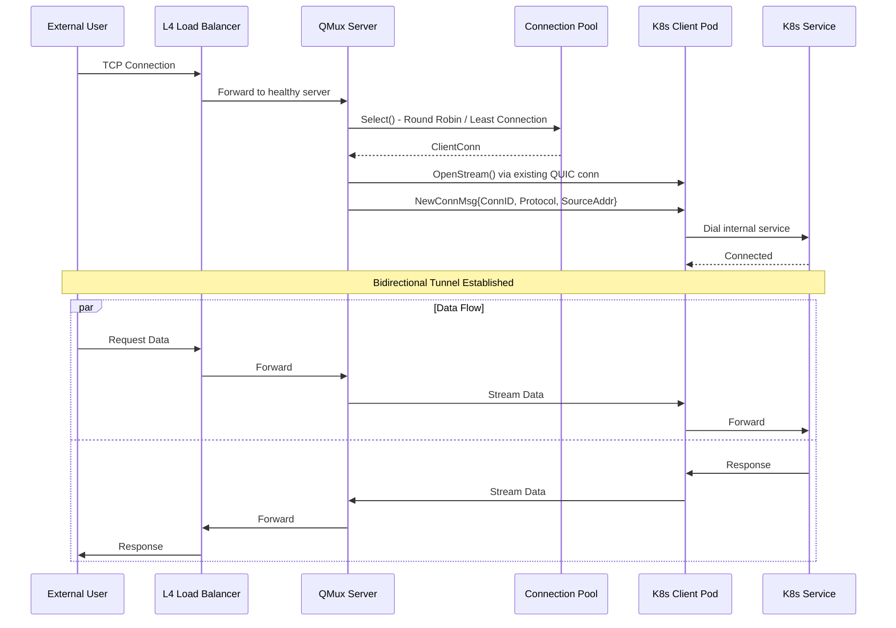

# QMux

[](https://github.com/Mmx233/QMux/blob/main/LICENSE)
[](https://github.com/Mmx233/QMux/releases)
[](https://goreportcard.com/report/github.com/Mmx233/QMux)
[](https://hub.docker.com/repository/docker/mmx233/qmux)

A high-availability L4 (transport layer) NAT traversal tool built on the QUIC protocol.

QMux operates at Layer 4 of the OSI model, enabling secure TCP/UDP tunneling through NAT/firewalls by establishing QUIC connections between clients and servers. It works at the transport layer, forwarding raw TCP streams without inspecting application-layer protocols. It supports multi-server configurations with automatic load balancing, mTLS authentication, and 0-RTT session resumption for fast reconnections.

# Performance

## Test Environment

| Component | Specification        |
|-----------|----------------------|
| CPU       | Apple M4             |
| Cores     | 10                   |
| Memory    | 16 GB                |
| OS        | macOS (darwin/arm64) |
| Go        | 1.25.5               |

## Benchmark Results

### Discard Test (5-second duration, loopback interface)

| Test | Raw (Baseline) | QMux        | Efficiency |
|------|----------------|-------------|------------|
| TCP  | 46,394 Mbps    | 1,726 Mbps  | 3.7%       |
| UDP  | 4,033 Mbps     | 2,566 Mbps  | 63.6%      |

### iperf3 Comprehensive Benchmark

| Test                  | Throughput (recv)   |
|-----------------------|---------------------|
| TCP Baseline 1-thread | 97,567 Mbps         |
| TCP Baseline 2-thread | 141,375 Mbps        |
| TCP Baseline 4-thread | 105,727 Mbps        |
| TCP QMux 1-thread     | 1,586 Mbps          |
| TCP QMux 2-thread     | 1,574 Mbps          |
| TCP QMux 4-thread     | 1,479 Mbps          |
| UDP Baseline 1-thread | 11,871 Mbps         |
| UDP Baseline 2-thread | 21,282 Mbps         |
| UDP QMux 1-thread     | 1,126 Mbps          |
| UDP QMux 2-thread     | 1,037 Mbps          |


Notes:

- Raw baseline represents direct loopback performance without any tunneling
- QMux adds QUIC encryption, multiplexing, and protocol overhead
- All tests use only 1 QUIC connection

Run benchmarks yourself:

```bash
# Quick speed report
go test -v -run TestSpeedReport ./cmd/run/...

# Comprehensive iperf3 benchmark
# Require iperf3 installed
go test -v -run TestIperf3 ./cmd/run/...
```

# High Available Architecture

## System Overview



## Data Tunnel Flow


