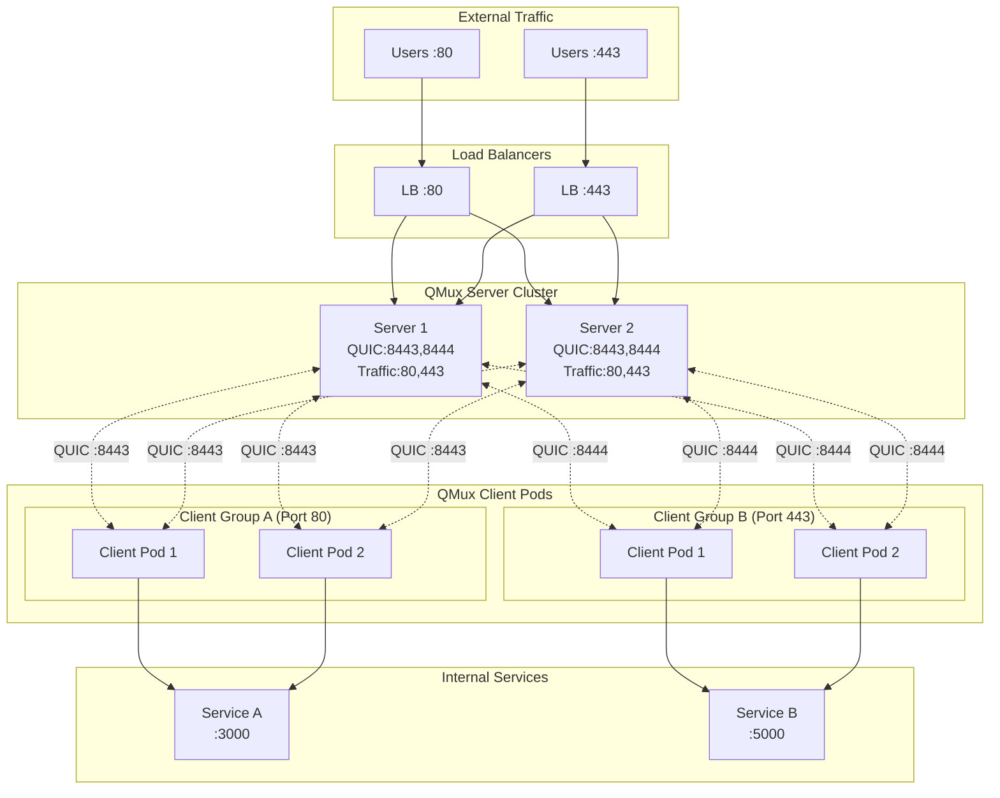
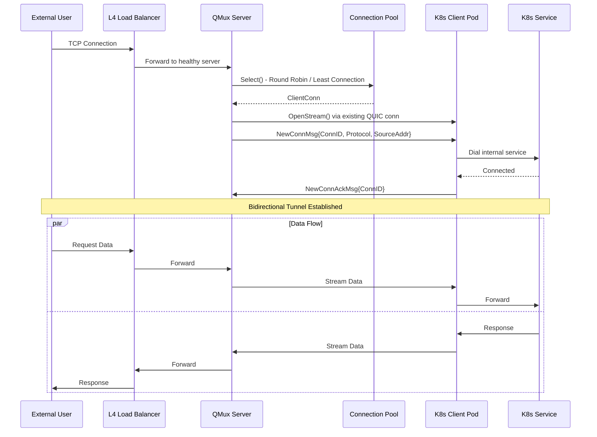

# QMux

[](https://github.com/Mmx233/QMux/blob/main/LICENSE)
[](https://github.com/Mmx233/QMux/actions/workflows/test.yml)
[](https://github.com/Mmx233/QMux/releases)
[](https://hub.docker.com/repository/docker/mmx233/qmux)

A high-availability L4 (transport layer) NAT traversal tool built on the QUIC protocol.

QMux operates at Layer 4 of the OSI model, enabling secure TCP/UDP tunneling through NAT/firewalls by establishing QUIC connections between clients and servers. It works at the transport layer, forwarding raw TCP streams without inspecting application-layer protocols. It supports multi-server configurations with automatic load balancing, mTLS or token authentication, and TLS session resumption for fast reconnections.

# Get Started

## Installation

### From Binary

Download the latest release from [GitHub Releases](https://github.com/Mmx233/QMux/releases).

### From Source

```bash
go install github.com/Mmx233/QMux@latest
```

### Docker

```bash
docker pull mmx233/qmux
```

## Quick Start

### 1. Generate Certificates

QMux uses mTLS for authentication by default. Generate the required certificates for testing:

```bash
qmux generate certs -s your-server-domain.com
```

The `-s` flag specifies the server DNS name for the certificate (required). You can specify multiple names:

```bash
qmux generate certs -s example.com -s qmux.example.com
```

Certificates are valid for 10 years by default. Use `-y` to customize:

```bash
qmux generate certs -s example.com -y 5  # 5 years validity
```

This creates in pwd:
- `certs/ca.crt` - CA certificate
- `certs/server.crt` / `certs/server.key` - Server certificate
- `certs/client.crt` / `certs/client.key` - Client certificate

### 2. Generate Configuration Files

```bash
# Generate server config
qmux generate config server -o server.yaml

# Generate client config
qmux generate config client -o client.yaml
```

### 3. Configure Example Server

Edit `server.yaml`:

```yaml
listeners:
  - quic_addr: "0.0.0.0:8443"    # QUIC control port
    traffic_addr: "0.0.0.0:8080" # Traffic forwarding port
    protocol: "both"              # tcp, udp, or both
    capacity:
      max_client_generations: 16
      max_pending_registrations: 128
      max_tcp_connections: 128
      max_pending_tcp_setups: 128
      max_tcp_connections_per_generation: 100
      max_pending_tcp_setups_per_generation: 16
      max_udp_sessions: 1024
      max_udp_sessions_per_generation: 256

auth:
  method: "mtls"
  ca_cert_file: "./certs/ca.crt"

tls:
  server_cert_file: "./certs/server.crt"
  server_key_file: "./certs/server.key"
```

### 4. Configure Example Client

Edit `client.yaml`:

```yaml
capacity:
  max_local_udp_sessions: 256

server:
  servers:
    - address: "your-server-ip:8443"
      server_name: "qmux-server"

local:
  host: "127.0.0.1"
  port: 3000  # Your local service port

auth:
  method: "mtls"

tls:
  ca_cert_file: "./certs/ca.crt"
  client_cert_file: "./certs/client.crt"
  client_key_file: "./certs/client.key"
```

| Key                                     | Scope                                                                  | Default | When full                                                                 |
|-----------------------------------------|------------------------------------------------------------------------|--------:|---------------------------------------------------------------------------|
| `max_client_generations`                | Server listener: client generations                                    |      16 | Reject the new client registration.                                       |
| `max_pending_registrations`             | Server listener: registrations not yet committed                       |     128 | Close the new registration connection.                                    |
| `max_tcp_connections`                   | Server listener: pending and active TCP flows                          |     128 | Close the new TCP connection.                                             |
| `max_pending_tcp_setups`                | Server listener: TCP flows still setting up                            |     128 | Close the new TCP connection.                                             |
| `max_tcp_connections_per_generation`    | Server listener: pending and active TCP flows on one client generation |     100 | Try another eligible generation; otherwise close the new TCP connection.  |
| `max_pending_tcp_setups_per_generation` | Server listener: pending TCP setups on one client generation           |      16 | Try another eligible generation; otherwise close the new TCP connection.  |
| `max_udp_sessions`                      | Server listener: server-side UDP sessions                              |    1024 | Drop the datagram that would create a new session.                        |
| `max_udp_sessions_per_generation`       | Server listener: server-side UDP sessions on one client generation     |     256 | Try another eligible generation; otherwise drop the new-session datagram. |
| `max_local_udp_sessions`                | Client process: local UDP sessions shared by all UDP handlers          |     256 | Drop the datagram that would create a new local session.                  |

All eight server settings are enforced independently for each `listeners` entry. `max_local_udp_sessions` is one process-wide client budget. Omitting a setting or using `0` selects its default; negative values are rejected, and there is no unlimited setting. When a gate is full, QMux rejects or drops only new work; it does not evict registered generations, established TCP connections, or existing UDP sessions.

The per-generation TCP gates are independent: `max_tcp_connections_per_generation` (100 by default) counts pending and active connections, while `max_pending_tcp_setups_per_generation` (16 by default) counts only connections still being established. A pending TCP setup remains counted through backend dial and the NewConn ACK round trip, so size this limit for peak concurrent setup latency; success activates it and failure or the setup deadline releases it.

For multi-listener deployments, calculate the aggregate budget from the actual listener count and workload, then validate the limits under that topology.

### 5. Run

```bash
# Start server (on public server)
qmux run server -c server.yaml

# Optionally expose liveness/readiness on loopback
qmux run server -c server.yaml --admin-address 127.0.0.1:9090

# Start client (on machine behind NAT)
qmux run client -c client.yaml
```

Now external traffic to `your-server-ip:8080` will be forwarded to your local service on port 3000.

The admin listener is disabled by default and serves `GET /healthyz` and `GET /readyz` when enabled. It has no authentication, so bind it only to loopback or a protected management network. Readiness returns `200 ok` only when every configured route is listening and has an eligible client for each enabled protocol; otherwise it returns `503 not ready`. QMux only reports this state. Any load-balancer or scheduler action remains external, and a business-port blackbox check remains the end-to-end data-path test.

## Authentication

QMux uses mTLS by default. In this mode the server and client verify one another with certificates, as shown in the quick-start configuration above.

Token authentication is available when distributing a client certificate is undesirable. Generate a machine-random secret with at least 256 bits of entropy, for example with `openssl rand -base64 32`, and configure the same value on both sides:

```yaml
# server.yaml
auth:
  method: "token"
  token: "replace-with-the-generated-secret"

tls:
  server_cert_file: "./certs/server.crt"
  server_key_file: "./certs/server.key"
```

```yaml
# client.yaml
auth:
  method: "token"
  token: "replace-with-the-generated-secret"

tls:
  ca_cert_file: "./certs/ca.crt"
```

The token itself is never sent over the wire. After the TLS 1.3 handshake completes, the client sends an HMAC-SHA512 registration proof bound to that connection through the TLS exporter. The client still validates the server certificate using `ca_cert_file`, while token mode neither requires nor sends a client certificate. A proof captured from one connection cannot authenticate another connection, including a resumed TLS session.

### Session ticket key rotation

By default, QMux leaves session ticket key rotation to Go. In the Go 1.27 baseline, Go rotates keys every 24 hours and expires them after 7 days; Go owns this automatic policy.

Set `tls.session_ticket_encryption_key_rotation_interval` to a positive duration to use QMux's custom rotation. `tls.session_ticket_encryption_key_rotation_overlap` is the number of old keys retained: omission or `null` uses the fixed default of 7 old keys (8 total), while numeric `0` retains no old keys. The overlap setting is invalid when the interval is zero or omitted.

# Performance

## Test Environment

| Component     | Specification                                                               |
|---------------|-----------------------------------------------------------------------------|
| QMux hosts    | Separate `c6i.large` server/client and separate `c6i.4xlarge` server/client |
| Traffic hosts | Separate `c6i.4xlarge` load generator and backend                           |
| Network       | Same-AZ private VPC; ENA                                                    |
| Software      | Amazon Linux 2023; stripped Linux/amd64 build                               |
| Security      | Mutual TLS; TLS 1.3; one QUIC connection per client                         |

## Transport Throughput

20 s × 3; medians. UDP: 1,200-byte/P1 at ≤0.1% median loss.

| QMux server/client | TCP forward P1 | TCP forward P4 | TCP reverse P1 | TCP reverse P4 | UDP forward delivered / loss |
|--------------------|---------------:|---------------:|---------------:|---------------:|-----------------------------:|
| `c6i.large`        |   2.942 Gbit/s |   3.163 Gbit/s |   2.949 Gbit/s |   2.861 Gbit/s |        499.8 Mbit/s / 0.035% |
| `c6i.4xlarge`      |   4.622 Gbit/s |   5.104 Gbit/s |   4.843 Gbit/s |   4.682 Gbit/s |        999.8 Mbit/s / 0.022% |

### Small-Packet UDP

| QMux server/client | Payload / parallel |    Delivered | Packet rate |   Loss |
|--------------------|--------------------|-------------:|------------:|-------:|
| `c6i.large`        | 256-byte / P4      | 100.0 Mbit/s |   48.8 kpps |     0% |
| `c6i.4xlarge`      | 256-byte / P4      | 499.5 Mbit/s |  243.9 kpps | 0.092% |

TCP reached host bandwidth limits; formal UDP points had no host drops.

## HTTP Service Workloads

Request path: user → QMux server → QMux client → nginx. Concurrency 32; 30 s × 3; medians.

| QMux server/client | Workload              |              Requests/s (min-max) |      p50 |      p99 | Errors / requests |
|--------------------|-----------------------|----------------------------------:|---------:|---------:|------------------:|
| `c6i.large`        | 1 KiB, keep-alive     |            48,817 (48,777-48,901) | 0.637 ms | 1.171 ms |     0 / 4,394,910 |
| `c6i.large`        | 1 KiB, new connection |               5,425 (5,424-5,464) | 5.873 ms | 9.114 ms |       0 / 489,440 |
| `c6i.large`        | 64 KiB, keep-alive    | 4,741 (4,706-4,756), 2.486 Gbit/s | 6.677 ms | 9.428 ms |       0 / 426,174 |
| `c6i.4xlarge`      | 1 KiB, keep-alive     |            68,216 (68,054-68,229) | 0.459 ms | 0.768 ms |     1 / 6,135,055 |
| `c6i.4xlarge`      | 1 KiB, new connection |            11,149 (11,130-11,224) | 2.844 ms | 4.440 ms |     0 / 1,005,168 |
| `c6i.4xlarge`      | 64 KiB, keep-alive    | 7,205 (7,034-7,374), 3.778 Gbit/s | 4.224 ms | 5.950 ms |      13 / 665,758 |

4xlarge keep-alive errors reproduced in confirmation runs.

## Ten-Minute Stability

One 600 s connection per row. Delivered/loss: final 5 min. CPU: full run, client+server. RSS: maximum client+server sum across three checkpoints.

| QMux server/client | Workload                           | Final 5 min delivered |    Loss / retransmits | Combined CPU-s/GiB | Maximum combined RSS |
|--------------------|------------------------------------|----------------------:|----------------------:|-------------------:|---------------------:|
| `c6i.large`        | TCP forward P4                     |          3.170 Gbit/s |    0 tail retransmits |               8.79 |             34.4 MiB |
| `c6i.large`        | UDP 1,200 B P1, 500 Mbit/s offered |        499.729 Mbit/s |          0.0542% loss |              44.50 |             34.5 MiB |
| `c6i.4xlarge`      | TCP forward P4                     |          5.139 Gbit/s |    0 tail retransmits |               8.12 |             39.3 MiB |
| `c6i.4xlarge`      | UDP 1,200 B P1, 1 Gbit/s offered   |        980.534 Mbit/s | 1.947% loss; >1% FAIL |              35.06 |             47.7 MiB |

## Client Failover

2 × `c6i.4xlarge` clients; least-connections; 100 new TCP connections/s; SIGKILL after ten clean 1 s bins; recovery = three clean bins.

| Metric                                  |                            Result |
|-----------------------------------------|----------------------------------:|
| Confirmed recovery time                 | 26.273 s median (22.201-27.246 s) |
| Start of stable zero-error period       | 24.223 s median (20.152-25.195 s) |
| Failed requests per 5,000-request trial |                 37 median (32-39) |

New TCP flows only; established connections are not migrated.

# High Available Architecture

## System Overview


```mermaid
flowchart TD
    subgraph External["External Traffic"]
        direction LR
        User1[Users :80]
        User2[Users :443]
    end

    subgraph LBLayer["Load Balancers"]
        direction LR
        LB1[LB :80]
        LB2[LB :443]
    end

    subgraph ServerCluster["QMux Server Cluster"]
        direction LR
        S1[Server 1<br/>QUIC:8443,8444<br/>Traffic:80,443]
        S2[Server 2<br/>QUIC:8443,8444<br/>Traffic:80,443]
    end

    subgraph ClientLayer["QMux Client Pods"]
        direction LR
        subgraph ClientGroup1["Client Group A (Port 80)"]
            C1A[Client Pod 1]
            C1B[Client Pod 2]
        end
        subgraph ClientGroup2["Client Group B (Port 443)"]
            C2A[Client Pod 1]
            C2B[Client Pod 2]
        end
    end

    subgraph Services["Internal Services"]
        direction LR
        SVC1[Service A<br/>:3000]
        SVC2[Service B<br/>:5000]
    end

    User1 --> LB1
    User2 --> LB2
    LB1 --> S1 & S2
    LB2 --> S1 & S2

    S1 & S2 <-.->|QUIC :8443| C1A & C1B
    S1 & S2 <-.->|QUIC :8444| C2A & C2B

    C1A & C1B --> SVC1
    C2A & C2B --> SVC2
```

## Data Tunnel Flow


```mermaid
sequenceDiagram
    participant User as External User
    participant LB as L4 Load Balancer
    participant Server as QMux Server
    participant Pool as Connection Pool
    participant Client as K8s Client Pod
    participant SVC as K8s Service

    User->>LB: TCP Connection
    LB->>Server: Forward to healthy server
    Server->>Pool: Select() - Round Robin / Least Connection
    Pool-->>Server: ClientConn
    
    Server->>Client: OpenStream() via existing QUIC conn
    Server->>Client: NewConnMsg{ConnID, Protocol, SourceAddr}
    
    Client->>SVC: Dial internal service
    SVC-->>Client: Connected
    Client->>Server: NewConnAckMsg{ConnID}
    
    Note over User,SVC: Bidirectional Tunnel Established
    
    par Data Flow
        User->>LB: Request Data
        LB->>Server: Forward
        Server->>Client: Stream Data
        Client->>SVC: Forward
    and
        SVC->>Client: Response
        Client->>Server: Stream Data
        Server->>LB: Forward
        LB->>User: Response
    end
```
